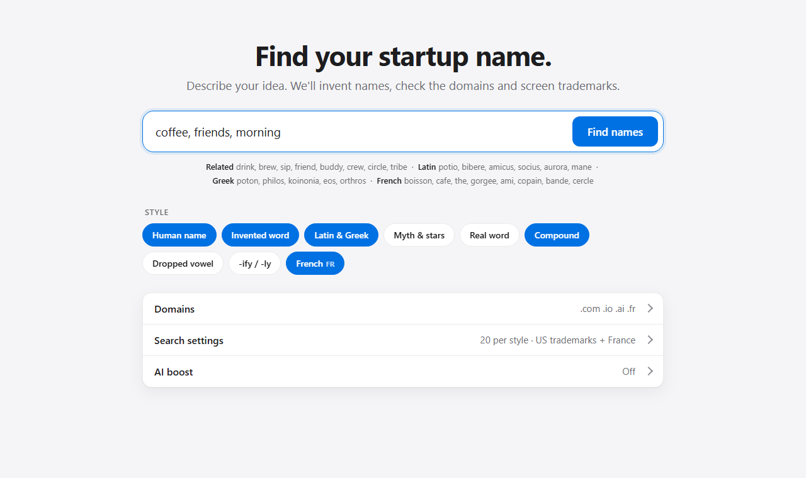
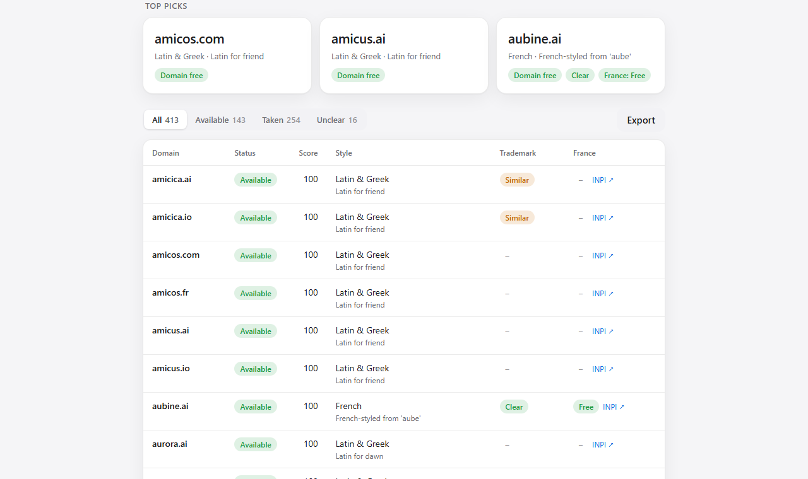

# Startup Name Finder (namestack)

**Find a startup name, check if the domain is free, and screen it for trademarks. All in one click, free, on your own computer.**

Type a few words you love and three words about what you're building. Startup Name Finder turns them into hundreds of brandable names (invented words, Latin & Greek roots, French words, compounds like Dropbox, human names like Alan...), checks live whether the `.com` / `.io` / `.ai` is actually available, and flags names that clash with US trademarks.





---

## How it works (30-second version)

1. **You type words you love** (`aurora, wolf, jazz`) and **three words about what you're building** (`coffee, friends, morning`).
2. **It expands the theme**: related words (*brew, sip, crew, dawn*), Latin (*amicus, aurora*) and Greek (*philos, eos*) roots.
3. **It invents names** in the styles you pick: *biberus*, *bluesip*, *amoto*, *sipleaf*...
4. **It checks every domain live**, straight from the official registries (the same source domain sellers use). Around 100 domains in a few seconds.
5. **It screens the free ones** against the US trademark office (USPTO) so you don't fall in love with a name you can't use. French names are also checked against the French company register.
6. **You export** your shortlist to a spreadsheet.

Optional: plug in an AI API key (free options below) and it also brainstorms with an LLM for smarter, more creative names.

Everything runs **on your computer**. No account, no sign-up, no tracking.

---

## Setup (no coding needed, about 5 minutes)

### Step 1: Install Python (one time only)

Python is the free engine this app runs on.

**Windows**
1. Go to **https://www.python.org/downloads/** and click the big yellow **Download Python** button.
2. Open the downloaded file.
3. ⚠️ **IMPORTANT:** at the bottom of the first screen, tick the box **"Add python.exe to PATH"**.
4. Click **Install Now**, wait, then close the installer.

**Mac**
1. Go to **https://www.python.org/downloads/**, click **Download Python**.
2. Open the downloaded `.pkg` file and click Continue / Install until it's done.

> Already have Python 3.9 or newer? Skip this step.

### Step 2: Download Startup Name Finder

1. At the top of this GitHub page, click the green **`<> Code`** button.
2. Click **Download ZIP**.
3. Unzip it:
   - **Windows:** right-click the ZIP file → **Extract All...** → **Extract**.
   - **Mac:** double-click the ZIP file.
4. Move the unzipped folder somewhere easy to find, like your Desktop.

> ⚠️ On Windows, don't run it from *inside* the ZIP preview window. Extract it first.

### Step 3: Start it

**Windows:** open the folder and double-click **`start_namestack.bat`**.

**Mac:** open the folder and double-click **`start_namestack.command`**.

- The **first time**, a black window appears and installs what it needs. This takes about a minute. Let it finish.
- Then your web browser opens automatically at **http://127.0.0.1:8787**. That's the app. 🎉
- **Keep the black window open** while you use the app. Close it when you're done.
- Next time, just double-click the same file again. It starts in a couple of seconds.

<details>
<summary><b>Windows says "Windows protected your PC"?</b></summary>

That's a normal warning for files downloaded from the internet. Click **More info** → **Run anyway**.
</details>

<details>
<summary><b>Mac says the file "can't be opened" or "is from an unidentified developer"?</b></summary>

Right-click (or Control-click) `start_namestack.command` → **Open** → **Open**. You only need to do this once.

If it still won't start: open the **Terminal** app, type `bash ` (with a space after it), drag `start_namestack.command` into the Terminal window, and press **Enter**.
</details>

<details>
<summary><b>The browser didn't open?</b></summary>

Open your browser yourself and go to **http://127.0.0.1:8787**
</details>

---

## What each button does

The screen is built around one button: type your idea, press **Find names** (or Enter), done. Everything else is tucked into collapsible rows you never have to open. **Hover over any button for 2 seconds** and a short explanation pops up.

### 1. Your idea
| Thing | What it does |
|---|---|
| **Words you love** | Your favorite words: ones that mean something to you or just sound cool (`aurora, wolf, velvet`). Comma separated. |
| **What you're building, in 3 words** | Three words that best describe your product, not a pitch (`coffee, friends, morning`). Both fields are used as a *theme*, not as the final name. |
| **Related / Latin / Greek / French line** | Appears as you type. It shows the words the app will build names from. |
| **Find names** (or Enter) | Go! Invents names, checks every domain live, then screens the free ones. Turns into **Stop** while running. |

### 2. Style
Click a style to turn it on (blue) or off. Pick as many as you like.

| Style | Example brands | What you get |
|---|---|---|
| **Human name** | Alan, Oscar, Clara | A friendly first name that fits your theme |
| **Invented word** | Tinder, Hulu, Zillow | A made-up word built from the sounds of your theme |
| **Latin & Greek** | Veritas, Lumen, Nexus | Ancient words that mean the same thing as your idea |
| **Myth & stars** | Nike, Hermes, Orion | Gods, heroes and stars linked to your theme |
| **Real word** | Apple, Slack, Stripe | An everyday word used as a metaphor |
| **Compound** | Dropbox, Snapchat | Two short words glued together |
| **Dropped vowel** | Flickr, Tumblr, Lyft | A familiar word with a twist in the spelling |
| **-ify / -ly** | Spotify, Calendly | A theme word plus a classic startup ending |
| **French** | Qonto, Lydia, Beausoleil | French words (*lalune*, *beausoleil*, *monami*), French-styled words and first names. French names are often still free. |

**When French is on**, `.fr` is added to the domains, and every French name with a free domain is checked against the **French company register** (the national register shown on [data.inpi.fr](https://data.inpi.fr), via the free government company search). Each result has an **INPI ↗** link that opens data.inpi.fr's trademark search for that name in your browser.

> Why a link for trademarks? data.inpi.fr blocks automated requests (Cloudflare browser check) and INPI's trademark API needs an account, so the app checks companies automatically and gives you a one-click trademark search.

### 3. Domains (collapsible)
| Thing | What it does |
|---|---|
| **`.com` `.io` `.ai` `.fr` ... buttons** | Choose which domain endings to check. Blue = will be checked. |
| **Other endings** box | Type any other endings, comma separated (e.g. `studio, shop`). |
| **Domain hacks** | Also tries clever splits where the ending is part of the word, like `spoti.fi` or `rad.io`. |

### 4. Search settings (collapsible)
| Thing | What it does | Leave it at |
|---|---|---|
| **Names per style** | How many names to invent for each style. More = more ideas, slower check. | 20 |
| **Minimum brand score** | Hide names scoring below this (see *Score* below). | 0 |
| **US trademark screen** | Checks available names against the US trademark database (USPTO). | On |
| **Screen up to** | How many available names get a trademark check (0 = all of them). | 20 |
| **Max domains to check** | Cap on the total number of domains to check (0 = no cap). | 0 |
| **Parallel checks** | How many domains are checked at the same time. Higher = faster, but some registries may ask you to slow down. | 20 |
| **Offline demo** | Fake results, no internet. Only for trying the app. ⚠️ Results are **not real** when this is on. | Off |

### 5. AI boost (collapsible, optional)
See [Unlock AI](#unlock-the-ai-boost-free-options) below for the full guide.

| Thing | What it does |
|---|---|
| **Provider** | Which AI company your key is from (Google Gemini, OpenAI, Claude, DeepSeek, Groq...). |
| **API key** | Paste your key here. |
| **Model** / **Base URL** | Filled in for you, leave them as they are. |
| **Remember on this device** | Saves the key in your browser so you don't paste it every time. Turn it off on shared computers. |
| **Connect** | Tests your key (costs nothing) and turns AI on. |
| **Disconnect** | Turns AI off and forgets the key. |
| **Use AI for the next search** | Turn AI ideas on or off without removing your key. |

### 6. Reading the results
**Top picks** shows the three best names whose domain is free and that passed the screens.

**Filter** (All / Available / Taken / Unclear) shows only that kind of result, with counts. **Export** downloads a spreadsheet (CSV) or JSON.

| Column | Meaning |
|---|---|
| **Domain** | The full domain name. |
| **Status** | 🟢 **Available**: nobody owns it, you can buy it. 🔴 **Taken**. 🟠 **Busy**: the registry asked us to slow down; run again later or lower Parallel checks. ⚪ **Unclear**: no clear answer. Hover for details. |
| **Score** | Brandability from 0 to 100: short, easy to say, easy to spell = higher. |
| **Style** | Which naming style made it, plus where the idea came from (e.g. *"Latin for drink"*, *"sip + leaf"*). |
| **Trademark** | **Clear** no US trademark found · **Low risk** related marks, no close match · **Similar** sounds like an existing mark · **Exact match** already a trademark · **?** couldn't check · **–** not checked. |
| **France** (French style only) | **Free** no French company uses the name · **Used before** only by a closed company · **Taken** an active French company uses it · **INPI ↗** opens the data.inpi.fr trademark search. |

> Found a name you love? Buy the domain at any registrar (Namecheap, Cloudflare, Porkbun, GoDaddy...). Availability can change minute to minute, so don't wait too long.

---

## Unlock the AI boost (free options)

The app works fine without AI. With AI, it brainstorms with a language model too: richer synonyms, real Latin/Greek words for *any* theme, and more creative names in every style. Each run makes **one** request to your provider, which costs a fraction of a cent (or nothing on free tiers).

### Easiest: Google Gemini (free)

1. Go to **https://aistudio.google.com/apikey** and sign in with any Google account.
2. Click **Create API key** (accept the terms if asked).
3. Click the **copy** icon next to your new key. It starts with `AIza...`.
4. In Startup Name Finder, click the **AI boost** row to open it.
5. **Provider:** choose **Google Gemini**.
6. **API key:** paste your key (Ctrl+V on Windows, Cmd+V on Mac).
7. Leave **Model** and **Base URL** as they are.
8. Optional: turn on **Remember on this device**.
9. Click **Connect**.
10. The AI boost row turns green: **"Google Gemini · On"**. Hit **Find names**. AI ideas appear with *"AI: ..."* under their style. ✨

### Other providers

Same steps, just pick a different **Provider** and get the key here:

| Provider | Get your key | Cost |
|---|---|---|
| **Google Gemini** | https://aistudio.google.com/apikey | Free tier |
| **Groq** | https://console.groq.com/keys | Free tier |
| **OpenRouter** | https://openrouter.ai/keys | Some free models, many paid |
| **DeepSeek** | https://platform.deepseek.com/api_keys | Very cheap, add a few dollars of credit |
| **OpenAI** | https://platform.openai.com/api-keys | Pay as you go, add credit first |
| **Anthropic (Claude)** | https://console.anthropic.com/settings/keys | Pay as you go, add credit first |
| **Other (OpenAI-compatible)** | e.g. [Ollama](https://ollama.com) on your own computer | Free, no key needed. Base URL `http://localhost:11434/v1`, Model = the model you pulled (e.g. `llama3.2`) |

### Is my key safe?

- Your key stays **on your computer**. It's only sent to the provider you picked, never anywhere else.
- If you untick **Remember on this device**, it's forgotten when you close the app.
- Treat it like a password: don't post it online or in screenshots.
- Paid providers: set a monthly spending limit in their dashboard for peace of mind.

### AI troubleshooting

| Message | Fix |
|---|---|
| *"The provider rejected the API key"* | The key was copied wrong or deleted. Copy it again, with no spaces. |
| *"Unknown model"* / *"model not found"* | AI companies retire old models. Look up a current model name on the provider's website and type it in the **Model** box. |
| *"rate limit"* | Free tiers have limits per minute. Wait a minute and try again. |
| *"AI brainstorm failed, using built-in ideas only"* | The run still works without AI. Check the message for the reason. |

---

## Troubleshooting

| Problem | Fix |
|---|---|
| **"Python was not found"** | Install Python (Step 1). On Windows, make sure you ticked **Add python.exe to PATH**. If you forgot, run the Python installer again → **Modify** → tick **Add Python to environment variables**. |
| **"Setup failed"** | Check your internet connection and double-click the start file again. |
| **The page won't load** | Make sure the black window is still open. Closing it stops the app. |
| **"Address already in use"** | The app is already running in another black window. Use that one, or close it first. |
| **Lots of RATE-LIMITED** | Lower **Concurrency** to 5-10 and run again. Google's registry (`.dev`, `.app`) only allows about 1 check per second, so big runs on those take a few minutes. |
| **`.es` always UNKNOWN** | Spain's registry has no public lookup, so it can't be checked. |
| **Start over from scratch** | Delete the `.venv` folder inside the app folder and double-click the start file again. |

---

## Good to know

- **Domain checks** use RDAP and WHOIS, the official registry records. "Available" is a very strong signal, but always confirm at checkout.
- **Trademark checks** are a quick first screen against the US trademark office only. They are **not legal advice**. Before you commit to a name, do a proper search (and talk to a lawyer if it matters).
- Be kind to registries: the defaults are polite. Cranking Concurrency to 100 on huge runs may get you rate-limited.

---

## For developers

<details>
<summary><b>Manual install & command-line usage</b></summary>

```bash
git clone https://github.com/YellowElonMusk/Startup-name-finder.git
cd Startup-name-finder
python -m venv .venv
.venv\Scripts\activate          # Windows (macOS/Linux: source .venv/bin/activate)
pip install -e ".[ai]"          # drop [ai] if you don't need Claude support
```

Web UI:

```bash
namestack-web                   # or: python -m namestack.server [--port 8787] [--no-open]
```

CLI with a live terminal table:

```bash
namestack --seeds "space,energy,orbit"
namestack --seeds "space,energy,orbit" --tlds "com,io,ai,dev" --concurrency 40 --output csv --out results.csv
namestack --seeds "nebula" --tlds "com,io" --output json --no-table
namestack --seeds "space,energy,orbit" --offline      # simulated lookups, no network
```

| Flag | Default | Description |
| --- | --- | --- |
| `--seeds` | *(required)* | Comma-separated seed words. |
| `--tlds` | `com,io,ai` | Comma-separated TLDs. |
| `--concurrency` | `20` | Max parallel availability lookups. |
| `--output` | `table` | `table`, `csv`, or `json`. |
| `--out` | | File path for the CSV/JSON dump. |
| `--limit` | `0` (all) | Cap on candidates to check. |
| `--min-score` | `0` | Drop candidates below this score. |
| `--offline` | `false` | Simulate lookups with no network. |
| `--skip-trademark` | `false` | Disable USPTO screening. |
| `--trademark-limit` | `20` | Max available wordmarks to screen (0 = all). |
| `--table-limit` | `200` | Max rows in the live table (0 = all). |
| `--no-table` | `false` | Suppress the live table. |
| `--available` | `false` | Show/dump only available domains. |

The live table renders to **stderr**; CSV/JSON goes to **stdout** (or `--out`), so you can pipe results cleanly.

</details>

<details>
<summary><b>Architecture</b></summary>

```
seed words ──► inspire.py (theme expansion + 9 naming styles) ──► generator.py (candidates, TLDs, domain hacks)
           ──► checker.py (DNS → registry RDAP → WHOIS) ──► trademark.py (USPTO) + inpi.py (France) ──► server.py (web UI) / cli.py (terminal)
```

```
namestack/
├── generator.py   # candidate pool: style ideas or classic combinators, TLD hacks
├── inspire.py     # lexicon (synonyms / Latin / Greek) + naming-style generators
├── phonetics.py   # sound-alike respellings, brandability scoring
├── ai.py          # optional LLM brainstorm (Claude / any OpenAI-compatible API)
├── checker.py     # async DNS → RDAP → WHOIS, per-registry pacing + backoff
├── net.py         # TLS context from the OS trust store
├── trademark.py   # USPTO wordmark collision screen
├── inpi.py        # French company register screen + data.inpi.fr links
├── server.py      # zero-dependency web UI + JSON/SSE API
└── cli.py         # Typer + rich live table + CSV/JSON dump
```

- **Availability:** DNS first (a name that resolves is registered), then RDAP at the TLD's own registry (IANA bootstrap), then port-43 WHOIS. Per-registry pacing, connection caps and a `Retry-After` circuit breaker. Uses the OS trust store, so it works behind corporate/antivirus HTTPS inspection.
- **AI:** keys live only in server memory (plus browser localStorage if "Remember" is ticked). Claude uses the official `anthropic` SDK with structured JSON output; everything else goes through the OpenAI-compatible `/chat/completions` endpoint.
- **Trademark:** uses the USPTO search endpoint, which is undocumented and may change. Failures degrade to `UNKNOWN` and never block a run.
- **Runtime deps:** `httpx`, `typer`, `rich`, `jellyfish` (+ optional `anthropic`).

</details>

---

## Contributing

Issues and pull requests are welcome. Ideas: more naming styles, more languages in the lexicon, trademark offices outside the US, social handle checks.

If this helped you name your startup, a ⭐ on the repo makes my day.

## License

[MIT](LICENSE). Free to use, change and share.
